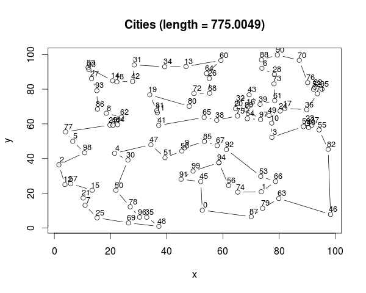

## TSP-Simulated Anneal (SA)

### Introduction
Simulated Anneal (SA) algorithm to solve a NP-hard problem ---- Travelling Salesman's Problem (TSP). 

The algorithm follows the assumptions:

* There always exists a path between two arbitary cities
* Any path is available in both directions
* Eculidean distance from cities' X-Y coordinates
* ……

Script `SimulatedAnneal.py` is built with `Python` standard library. Press `Ctrl + c` at any time.

### Usage
#### Input
Input city coordinates `cities-coordinate.json`  file in the following JSON format:
```
{
	"x": [52.66, 73.66,...],
	"y": [10.19, 20.85,...]
}
```
#### Basic Usage
In command line run:

```
cat cities-coordinate.json | python SimulatedAnneal.py
```
#### Arguments
Some arguments provided:

* `--maxTemperature`: initiate starting temperature, default `30.0`;
* `--pho`: decrease rate of temperature, default `.99`;
* `--length`: initiate starting length for maximum temperature, default `100`;
* `--length_increment`: length increment after each time temperature decrease, default `100`, 
* `--minTemperature`: minimum temperature, default `0.001`
* `--maxIterations`: maximum iteration steps for annealing procedure, default `10**8`

### Results

My best result:

```
[
  94, 99, 91, 45, 0, 87, 79, 63, 46, 82, 
  55, 40, 37, 23, 59, 3, 10, 49, 24, 17, 
  36, 71, 95, 52, 22, 76, 70, 90, 88, 6, 
  28, 73, 61, 39, 43, 32, 20, 16, 89, 97, 
  54, 75, 38, 65, 41, 11, 81, 19, 80, 72, 
  68, 26, 64, 60, 13, 34, 31, 42, 18, 14, 
  83, 33, 27, 93, 86, 8, 62, 84, 44, 29, 
  77, 5, 98, 2, 12, 57, 15, 21, 7, 25, 
  69, 48, 35, 96, 78, 50, 30, 4, 47, 51, 
  58, 9, 85, 67, 92, 53, 66, 1, 74, 56, 94
]
```



### Limitation
The final optimized routine varies every time. Theoretically, the path converge to the shortest path *in probability*. See more details in [wiki](http://en.wikipedia.org/wiki/Simulated_annealing).

An optimized path from grid points:

run `python cities_grid.py 10 | python SimulatedAnneal.py --maxTemperature 3 --maxIterations 5000000`


**Good Luck!**
